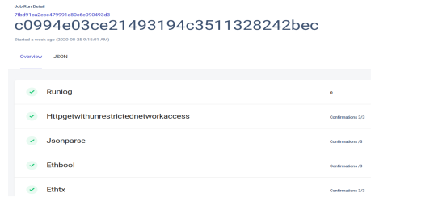

<p align="center">
<h2 align="center">Master thesis</h2>
<h3 align="center">Smart contracts on blockchain network</h3>
<h4 align="center">Mentor: prof. dr. sc. Luka Grubisic</h4>
<h4 align="center">University of Zagreb</h4>
<h4 align="center">Department of Mathematics</h4>
</p>
</br>


<p align="center">

</p>

## Table of contents

* [About](#about)
* [1. Smart contracts](#smart-contracts)
  * [1.1 Definition](#smart-contract-definition)
  * [1.2 Description of project](#description)
  * [1.3 Implementation of smart contract](#smart-contract-implementation)
* [2. Chainlink node](#chainlink-node-main)
  * [2.1 Description of technology and processes](#chainlink-node-description)
  * [2.2 Implementation](#chianlink-node-implementation)
* [3. Web app](#web-app)
* [4. Mobile App](#mobile-app)
* [5. Final thoughts and conclusion](#final-thoughts)
* [Bonus project (Kubernetes Raspberry Pi Cluster)](#bonus-project)


<a name='about'/>

## About
This is documentation for my master thesis project at **University of Zagreb, Faculty of Mathematics**.
My initial master thesis was _Rough volatility models for option pricing_ because I wanted to apply stochastic calculus
and learn how to model volatility in financial markets. But as I became more interested in programming, cryptocurrency, and blockchain, I decided to find a new thesis and project.
Also, I wanted to design some complex distributed systems in both decentralized and centralized architecture, like blockchains and Kubernetes.
This would help me accelerate my learning and understanding of current software landscape and master things like
networking, programming with various programming languages and usage of cloud architecture.
Working on this project was such an excellent learning experience.
I enjoyed configuring and synchronizing all these small moving parts and building them into a functional ecosystem.


##### Folders

`react_dapp/` - React frontend Dapp in Javascript

`chainlink_node/` - Chainlink configuration files and jos specification

`geth_client/` - Geth Ethereum client kubernetes files

`data_adapter/` - Express JS server for location data processing and storage

`pi-cluster` -  (Bonus project) RaspberryPi Kubernetes Cluster files

`truffle_movementApp` - smart contract Movement in Solidity with truffle framework


<a name='smart-contracts'/>

# 1. Smart contracts


## 1.1 Definition
<a name='smart-contract-definition'/>

A smart contract is a computer program or transaction protocol that is intended to execute automatically
any programming logic, control or document relevant events and make actions.
With the help of smart contracts, we could make digital manifestations for all kinds of traditional contracts.
The main idea behind digital contracts is that execution is done on some decentralized network without any
centralized third parties. Blockchains are one of the solutions where these smart contracts could be built on and run.
In this master thesis, I will try to showcase one possible implementation of smart contracts in the real world.
We will demonstrate how to communicate with smart contracts on a blockchain with the help of a special kind of web application
called `Dapp` with the prefix `d`, indicating that they are using blockchain for their database and communication.
This is a significant change from most modern applications, where the app communicates through API with the central database and server.

Also, the goal of this master thesis is to show how smart contracts could communicate with real world and fetch data from outside of the blockchain.
This is a big problem with smart contracts because blockchains are closed systems, and its consensus mechanism cannot
securely verify data outside itself without compromising protocol.

This kind of problem is solvable with help of a decentralized oracle network like `Chainlink`, which is responsible
for fetching the data to the blockchain and executing any kind of actions outside blockchain network.
We will show how our smart contract can communicate with the outside world with Chainlink protocol.

<a name='description'/>

## 1.2 Description of project

#### Motivation


The goal of this project was to design some kind of decentralized platform that would use location data from Android smartphones.
Because smart contracts don't have information about data from the outside world, we need to check securely that some action actually happened in the real world.
We can do this with the help of decentralized oracle network protocol like Chainlink.
We designed a small ecosystem and its corresponding architecture where smart contract could check if the user did make some location distance from point A to point B.
If this task is achieved, smart contract will check the corresponding route and reward user with some cryptocurrency.
To check that user executed this route correctly, smart contract needs location data when user started to run this task.
To achieve this, we made a mobile Android app in Kotlin that will help users execute target routes.
Also, smart contract will use our app as location data source and data will be sent to Chainlink nodes for processing.
This mobile app serve user like a digital twin.
We designed this ecosystem and called it `Movement`. Let's explore all the parts.


### Parts
The whole ecosystem consists of multiple parts, each with its own rules and tasks. When
organized together, it works like a decentralized distance and route checking platform.

#### Smart contract on Ethereum
Smart contract called `Movement` will be deployed to Ethereum testnet Kovan, and it will be the primary source of communication
with the web app and mobile app. It will serve as central database where we will write all the data about users, routes and status of these routes.

#### Web application or `Dapp`
Frontend web app in React. It will register new users, make new routes and keep track of status of these routes.

#### Mobile Android application
Android app in Kotlin. Registered user will use this app as a helper when executing routes in the real world. Also, smart contract and
Chainlink node will use GPS data to confirm that user did make distance from start to end location.


<p align='center'>

</p>

<p align='center'>
<em>Picture 1.1: Parts of master thesis project</em>
</p>


Also, there will be multiple entities in our ecosystem.

#### Routes
Routes will be distances from start to end point that registered users can complete for compensation in cryptocurrency. Routes will be created
through `Dapp`. Everybody can create routes and deposit Ethereum as route completion payment.

#### User
Users will be participants of this ecosystem who will execute routes. They will also register through app so they can have
access to mobile app, which will serve them as a guide for completing routes.

#### Nodes
Nodes are microservices that will have multiple processes running in Docker containers to help Chainlink nodes determine
if user did finish route correctly.


<p align='center'>
    
</p>

<p align='center'>
<em>Picture 1.2: Ecosystem and tech overview</em>
</p>


<a name='smart-contract-implementation'/>

## 1.3 Implementation of smart contract

Most smart contracts on Ethereum are written in `Solidity`. This programming language has inherited many properties from C++, Python and Javascript.
It is statically typed and supports inheritance, libraries and complex user-defined types among other features.
Also, every smart contract has its own __Application Binary Interface__ (ABI), which describes functions, variables and events.
ABI helps to connect smart contracts with other programming languages and libraries.
Specifically, we will use `web3j` for our mobile app in Kotlin and `web3js` for our web app in Javascript.
To deploy smart contract on blockchain, first we need to compile solidity code in bytecode which can Ethereum virtual machine (EVM) process.

## Tools

### Remix IDE
Online tool for writing and debugging smart contracts in Solidity where we can read function and write data to the blockchain to
test functionality. We will connect our local folder with this online editor.

### Metamask wallet
This is browser extension that serves as a digital wallet. This wallet can then communicate with smart contracts and web Dapps.
Because writing data on blockchain is not free, we need some Ether in our wallet. We will use it as a connector with Remix IDE and
smart contracts because Metamask injects web3 API into the DOM (Document Object Model) of every frontend website which
uses web3 tools.


#### Ethereum RCP client (Infura)

Infura is blockchain company and platform for real-time connectivity with the Ethereum blockchain.
We need a blockchain RPC client because the mobile app and Chainlink nodes need to be connected to Ethereum blockchain to read and write relevant data.
Chainlink node is connected with Websocket protocol for real-time connection. It needs to constantly monitor blockchain events and wait for
target Jobs.
The mobile app is connected with HTTPS protocol to write data when created.


<p align='center'>

</p>
<p align='center'>
<em>Picture 1.3: Blockchain connection for apps</em>
</p>


## Implementation

Smart contracts written in Solidity are no different from other programs in object-oriented style.
We could look at every smart contract as class with its own variables and functions. Also, it could inherit other functions and variables
from other classes.

Every smart contract consists of these types:
- variables
- functions
- function modifiers
- events
- structs


### Inheritance
#### Chainlink client
It gives our smart contract functionality to communicate with Chainlink nodes with the help of various functions to send Chainlink requests.
#### Ownable
It helps with ownership of smart contract and authentication.

### Struct objects

Let's define all the complex data types which will we use through project.

### User

```solidity
struct User {
    uint userId;
    string username;
    string password;
    address addr;
    bool isExist;
    uint routesStarted;
    uint routesCanceled;
    uint routesFinished;
    uint routesCompleted;
}
// mapping from user address to userId
mapping(string =>bool) userExistsByUsername;
mapping(address => bool) userExistsByAddress;
mapping(string => uint) userIndexByUsername;
// Users array
User[] public users;
```


### Route

```solidity
struct Route {
    uint routeId;
    address maker;
    string taker;
    string startLocation;
    string endLocation;
    bool isStarted;
    bool isFinished;
    bool isCompleted;
    string description;
}
 // Routes array
Route[] public routes;
```


### Chinlink Node

```solidity
struct Node {
    uint nodeId;
    string nodeName;
    string ip;
    string data_endpoint;
    address oracleContractAddress;
    uint routesChecked;
    string jobIdDistance;
    string jobIdTime;
    string jobIdStatus;
    }
// Nodes array
Node[] public nodes;
```


### RouteStartEvent
When users accepts the route on mobile app, this object is created and corresponding event is emitted.

```solidity
struct RouteStartEvent{
    uint routeStartId;
    uint routeId;  // which route
    string username;    // who started this route
    uint timestamp;   // when the event has been published
    bool node1Status;
    bool node2Status;
}
RouteStartEvent[] public routeStartEvents;
```


### RouteEndEvent
This object is created when user has finished the route on mobile app, and before Chainlink nodes 
confirms the validity of user passing this route on blockchain.
Also, we write information if user cancelled route or submitted it, and how many data points did
our two data adapters of Chainlink nodes received.

```solidity
struct RouteEndEvent{
    uint routeEndId;
    uint routeId;
    string username;
    uint timestamp;     // when the event has been published
    uint dataPoints;    // how many coordinate data points the app recorded
    uint node1DataPoints;
    uint node2DataPoints;
    uint userStatus;  // state in which route finished - did user cancel route, or sumbited it 
} 
RouteEndEvent[] public routeEndEvents; 
```


### CheckStatusEvent
It contains all the data from Chainlink nodes about status of route, distance and time.
We use two nodes in our decentralized oracle network.

```solidity
struct CheckStatusEvent{
    uint checkStatusId;
    uint routeId;
    string username; // for which user we are checking if he completed the route;
    uint timestamp;
    uint node1Distance;
    uint node1Time;
    bool node1Status;
    uint node2Distance;
    uint node2Time;
    bool node2Status;
}
CheckStatusEvent[] public checkStatusEvents;  
```

### Events
Events are an important part of every smart contract. It abstracts the logging functionality on blockchain.
Applications can subscribe and listen to these events through the RPC interface of an Ethereum client.
They are stored in the transaction's log - a special data structure in the blockchain.
Here is the list of events that our smart contract will emit.


```solidity
event UserCreated(uint userIndex);

event RouteCreated(uint routeIndex);

event StartRouteEvent(uint routeStartId);

event EndRouteEvent(uint routeEndId);

event StatusCheckEvent(uint checkStatusId);

event StatusCheckFulfilled(uint checkStatusId);

event CompletedRouteEvent(uint routeCompletedId);
```

## Global variables

### Address of agent
`Agent` is entity who records and writes all user interaction on mobile app. He is really import because he writes
data about decision user did take. He is not responsible for validating if user did finish the route, he just monitors
what is the responsible for. We will explain more about `Agent` in mobile app documentation section.

#### Address of LINK ERC20 token
    Chainlink nodes and its corresponding smart contracts needs to know exact address of LINK token which will server 
    as medium of exchange for completed requests.

### Oracle payment
How many LINK tokens will Chainlink nodes get per completed work/job.


### Constants related to mobile app

```solidity
uint constant private ORACLE_PAYMENT = 1*LINK; 

address constant LINK_TOKEN_ADDRESS =0xa36085F69e2889c224210F603D836748e7dC0088;

 
// Constants related to states that can happen with started route
 uint constant USER_CANCELED = 1;
 uint constant USER_SUBMITED_ROUTE = 2;
                                    
```


## Functions


### addUser

Smart contract will register new user and give him access to mobile android app where the user will log in with help of username and password.
We initialized all the data related to routes to zero.

```solidity
function addUser(string memory _username, string memory _password) public {
    users.push(User(users.length+1,_username,_password,msg.sender,true,0,0,0,0));
    userExistsByUsername[_username]=true;
    userExistsByAddress[msg.sender]=true;
    userIndexByUsername[_username]=users.length-1;
    emit UserCreated(users.length-1);
}
```

### addRoute

Adds new route on blockchain that some user submitted on Dapp. For creating new routes we need start and end location in GPS coordinates, in format of 
longitude and latitude.

```solidity
function addRoute(string memory _startLocation,string memory _endLocation,string memory _description)public {
    string memory taker = '';
    routes.push(Route(routes.length+1,msg.sender,taker,_startLocation,_endLocation,false,false,false,_description));
    emit RouteCreated(routes.length-1);
}
```

### addNode
It registers new Chainlink node and writes all the relevant data like IP address and endpoint of `DataAdapter` so the mobile app
knows where to send location data for Chainlink node to process.
Format is _endpoint:port_ (eg. 53.233.21.21:5000)

```solidity
function addNode(string memory _name,string memory _ip,string memory _data_endpoint,
                address _oracleContractAddress,
                string memory _jobIdDistance,
                string memory _jobIdTime,
                string memory _jobIdStatus) private {
    nodes.push(Node(nodes.length+1,_name,_ip,_data_endpoint,_oracleContractAddress,0,_jobIdDistance,_jobIdTime,_jobIdStatus));
}
```


### startRouteEvent
This function is called by `Agent` from mobile app when user accepts the route and starts walking.
We are changing the status of route, so it is reflected on mobile app to other users.
Also, this function contains the modifier `onlyAgent` so that only agent with his private key,
can run this function.

```solidity
// Agents functions
function startRouteEvent(uint _routeId,string memory _username,bool _node1Status,bool _node2Status) public onlyAgent{
    // require that user is registerd and exists
    require(userExistsByUsername[_username],"User doesnt exists");
    // Change route status
    // Dont forget to add -1 because its index of array
    routes[_routeId-1].isStarted = true;
    routes[_routeId-1].taker =_username;
    users[userIndexByUsername[_username]].routesStarted+=1;
    // Add info to routesStartEvents
    routeStartEvents.push(RouteStartEvent(routeStartEvents.length+1,_routeId,_username,now,_node1Status,_node2Status));
    emit StartRouteEvent(routeStartEvents.length-1);    
}

```
### endRouteEvent

It is called when user finishes the route on mobile app. There could be a possibility that user canceled the route
and stopped the application. We will write this data too because user needs to be penalized if he started route but
did not finish it. We will also write some metadata about routes(number of location GPS changes and other)

```solidity
function endRouteEvent(uint _routeId,string memory _username,uint user_event,uint _dataPoints,uint _node1DataPoints,uint _node2DataPoints)public onlyAgent{
    uint len = routeEndEvents.length;
    if(user_event == USER_CANCELED){
        // User canceled so we dont care about any other data
        // we init both dataPoints and node data to 0
        routeEndEvents.push(RouteEndEvent(len+1,_routeId,_username,now,0,0,0,USER_CANCELED));
        routes[_routeId-1].isStarted = false;
        routes[_routeId-1].taker ='';
        users[userIndexByUsername[_username]].routesCanceled+=1;
        emit EndRouteEvent(routeEndEvents.length-1);
    }else if(user_event == USER_SUBMITED_ROUTE){
        // User sumbited route
        routeEndEvents.push(RouteEndEvent(len+1,_routeId,_username,now,_dataPoints,_node1DataPoints,_node2DataPoints,USER_SUBMITED_ROUTE));
       routes[_routeId-1].isFinished =true;
       users[userIndexByUsername[_username]].routesFinished+=1;
       // User submited route - call requestRouteStatus to ask chainlink nodes about route status
       requestRouteStatus(_routeId,_username);
       emit EndRouteEvent(routeEndEvents.length-1);
    }
}
```

### requestRouteStatus
Private function that will be called from function `endRouteEvent` if user finishes the route.
Entity `Agent` on mobile app will call this function and he will pay for transactional costs on blockchain.
This function sends special kind of request called `ChainlinkRequest` to selected address for Chainlink node.
It is sending signal to oracle network that we need data previously specified in Job configuration.
We need information if user did finish route, in what time and distance.


```solidity
    
// Request route status by user on dapp
function requestRouteStatus(uint _routeId,string memory _username) private {
    
    string memory _routeIdString = uintToString(_routeId);

    // Init CheckStatusEvent data -- we will write to this variable all our results
    checkStatusEvents.push(CheckStatusEvent(checkStatusEvents.length+1,_routeId,_username,now,0,0,false,0,0,false));
    emit StatusCheckEvent(checkStatusEvents.length);
    
    //--------------Node 1 -----------------------
        // Distance Data Request
        Chainlink.Request memory req1 = buildChainlinkRequest(stringToBytes32(nodes[0].jobIdDistance),address(this),this.fulfillDistanceRequest1.selector);
        req1.add("extPath",_routeIdString);
        sendChainlinkRequestTo(nodes[0].oracleContractAddress,req1,ORACLE_PAYMENT);
        
        // // Time Data Request
         Chainlink.Request memory req2 = buildChainlinkRequest(stringToBytes32(nodes[0].jobIdTime),address(this),this.fulfillTimeRequest1.selector);
        req2.add("extPath",_routeIdString);
        sendChainlinkRequestTo(nodes[0].oracleContractAddress,req2,ORACLE_PAYMENT);
        
        // Status Data Request
         Chainlink.Request memory req3 = buildChainlinkRequest(stringToBytes32(nodes[0].jobIdStatus),address(this),this.fulfillStatusRequest1.selector);
        req3.add("extPath",_routeIdString);
        sendChainlinkRequestTo(nodes[0].oracleContractAddress,req3,ORACLE_PAYMENT);
   
    // -------------------- Node 2 -------------------------------
       // Distance Data Request
        Chainlink.Request memory req4 = buildChainlinkRequest(stringToBytes32(nodes[1].jobIdDistance),address(this),this.fulfillDistanceRequest2.selector);
        req4.add("extPath",_routeIdString);
        sendChainlinkRequestTo(nodes[1].oracleContractAddress,req4,ORACLE_PAYMENT);
        
        // // Time Data Request
         Chainlink.Request memory req5 = buildChainlinkRequest(stringToBytes32(nodes[1].jobIdTime),address(this),this.fulfillTimeRequest2.selector);
        req5.add("extPath",_routeIdString);
        sendChainlinkRequestTo(nodes[1].oracleContractAddress,req5,ORACLE_PAYMENT);
        
        //Status Data Request
         Chainlink.Request memory req6 = buildChainlinkRequest(stringToBytes32(nodes[1].jobIdStatus),address(this),this.fulfillStatusRequest2.selector);
        req6.add("extPath",_routeIdString);
        sendChainlinkRequestTo(nodes[1].oracleContractAddress,req6,ORACLE_PAYMENT);
        
        emit StatusCheckFulfilled(checkStatusEvents.length);
}
```

### Fulfill set of functions
Special set of functions which are called when Chainlink nodes finish target job and check that they received LINK 
cryptocurrency as payment, then they write all the data to blockchain.
```solidity
// Status Callbacks for node1 && node2

function fulfillStatusRequest1(bytes32 _requestId,bool _status)public recordChainlinkFulfillment(_requestId){
    checkStatusEvents[checkStatusEvents.length-1].node1Status = _status;
    }

function fulfillStatusRequest2(bytes32 _requestId,bool _status)public recordChainlinkFulfillment(_requestId){
checkStatusEvents[checkStatusEvents.length-1].node2Status = _status;
    }
```


<a name='chainlink-node-main'/>

# 2. Chainlink node

Here we will describe Chainlink node, all of its parts and their use case. When we say `Node` throughout this master thesis
we mean all of the parts like DataAdapter, Mongo database and other, which all helps achieve functionality we need.

<a name='chainlink-node-description'/>

## 2.1 Description of technologies and processes

We decided to use two Chainlink nodes to showcase and model simple Oracle network.
Both nodes are two Linux servers on AWS cloud. These servers will be the identical, in terms of code and
implementation. That is why both nodes will return the same data to blockchain, when smart contract asks them to check the validity of user finishing routes. Even though both nodes are the same, we are trying to show how smart contract could decentralize its source of outside data and not depend on only one source.
In real world, the ideal implementation would be multiple nodes running by different entities and with different source code. This would give even more robustness and decentralization to oracle networks.
<p align='center'>


</p>

<p align='center'>
<em>Picture 2.1: Aws EC2 instances</em>
</p>


Here is the list of all other helping process and technologies Chainlink nodes is using.


<p align='center'>

</p>
<p align='center'>
<em>Picture 2.2: EC2 server and its processes (Chainlink node architecture)</em>
</p>


### Docker
We needed to manage multiple processes running on the same Linux server, so we chose Docker as our orchestration
technology. With Docker, it is easy to start and stop the process, and every application is a like container that runs its application code in an isolated process.
With the help of virtualization, Docker can package an application and its dependencies in a virtual container that can run on any machine.
Because Docker containers are lightweight, a single server or virtual machine can run several containers simultaneously.
This is a more efficient implementation than virtual machines in terms of memory and OS resources.
We used `docker-compose` to manage multiple running containers/processes that needed to communicate
with each other.
Every Docker container is built from the base image and all other libraries and dependencies.
At the end, we copy the main source code of an application and specify ports on which app will listen for other connections.


### PostgresSQL i MongoDB

All the relevant data, events and configuration about jobs that will Chainlink node use are written in Postgres database.
For location data coming from the mobile app, we use the non-relational database MongoDB, which will our `DataAdapter` use
as main source of data.


### Redis
Redis is an efficient key-value store,but it also implements a pub-sub mechanism. We need this
property, because we will use it as a data queue in which we will write all the location data coming from the mobile app.
Worker in NodeJs is listening to these events and processing all the data.


### DataAdapter

DataAdapter is a NodeJS web server in Express which is connected to MongoDB database.
It has open routes/URLs and accepts location data from the mobile app
when a user starts executing selected route.
When this process receives the data, it writes data point to Redis so our worker can process it.
The worker process runs on the same Docker container and is connected with Redis with the help of `bulljs` packages.


### Nginx

We put Nginx as a reverse proxy in front of our web server to gain more security.
This process only forwards data to our DataAdapter.


### Chainlink node
Chainlink node serves as middleware between blockchain and outside real world. Goal of Chainlink Oracle network
is that all nodes on network are standardized and use same structure and specification for target jobs.
Properties of Chainlink nodes are:
 - Easy connectivity with smart contracts on blockchain with any API or outside system
 - Various method of fetching and processing data for smart contracts
 - Automatic writing of result of data fetching and processing on blockchain
 - Parsing and translation of data to Ethereum native data types
 - Making notification for each state change on smart contracts 

At initialization stage, Chainlink nodes creates private and public key so it could have
its own address on blockchain. With this address he write the results of jobs it serves.

### Docker processes

Bellow you could see the list of all docker containers on Linux server.

<p align='center'>

</p>

<p align='center'>
<em>Picture 2.3: Chainlink node docker processes</em>
</p>


<a name='chianlink-node-implementation'/>

## 2.2 Implementation

As we describe our system qualitatively, let us focus on the technical implementation of Chainlink node.
Also,we need email and password for Chainlink dashboard,
so we can track all the jobs that are being requested.


First we need to initialize Chainlink node with environmental variables.

<p align='center'>

</p>

<p align='center'>
<em>Picture 2.4: Environmental variables for Chainlink node</em>
</p>


### Jobs

Fetching of data or processing some task outside blockchain are specified and run through an entity called `Job`.
Its specification has sequential tasks which Chainlink node needs to run if it wants to get desired result.
Its written in JSON format and it looks like this:


1. **Initiator** - entity that is responsible for job initialization 
- Cron
- Eth log
- Run log
2. **Tasks** - individual steps that Chainlink node follows to get target results. Each task has set of adapters and parameters.
- HttpGet
- JsonParse
- Multiply
- EthBool
- EthTx

In our project, we need 3 types of data which our smart contract `Movement` needs.These are:

### Status of routes

We want to know if user had visited the start location, and after than he went to end location. Then we conclude
that use did correctly finish the corresponding route and that status is positive/completed.


```json
{
  "initiators": [
    {
      "type": "runlog"
    }
  ],
  "tasks": [
    {
      "type": "httpgetwithunrestrictednetworkaccess",
      "params": {
        "get": "http://localhost:3000/api/route/status"
      }
    },
    {
      "type": "jsonparse",
      "params": {
        "path": [
          "distance"
        ]
      }
    },
    {
      "type": "multiply",
      "params": {
        "times": "1"
      }
    },
    {
      "type": "ethuint256"
    },
    {
      "type": "ethtx"
    }
  ]
}
```


### Travelled distance

Distance in kilometers between start location and end location.
```json

{
  "initiators": [
    {
      "type": "runlog"
    }
  ],
  "tasks": [
    {
      "type": "httpgetwithunrestrictednetworkaccess",
      "params": {
        "get": "http://localhost:3000/api/route/status"
      }
    },
    {
      "type": "jsonparse",
      "params": {
        "path": [
          "time"
        ]
      }
    },
    {
      "type": "multiply",
      "params": {
        "times": "1"
      }
    },
    {
      "type": "ethuint256"
    },
    {
      "type": "ethtx"
    }
  ]
}
```


### Time
Measured time for travelling.
```json
{
  "initiators": [
    {
      "type": "runlog"
    }
  ],
  "tasks": [
    {
      "type": "httpgetwithunrestrictednetworkaccess",
      "params": {
        "get": "http://localhost:3000/api/route/status",
        "extPath": "1"
      }
    },
    {
      "type": "jsonparse",
      "params": {
        "path": [
          "routeFinished"
        ]
      }
    },
    {
      "type": "ethbool",
      "params": {}
    },
    {
      "type": "ethtx"
    }
  ]
}
```


With help of these data points, we will have complete overview about user finishing route
and all the corresponding data will be written on blockchain.


<p align='center'>

</p>

<p align='center'>
<em>Picture 2.4: Completed Chainlink Jobs</em>
</p>


<p align='center'>

</p>

<p align='center'>
<em>Picture 2.5: Chainlink Job Details</em>
</p>


### Oracle Smart contract


As we have all the job specifications with corresponding tasks and initialized Chainlink node, everything is ready
to connect with blockchain and our smart contract.
Let's use Chainlink terminology and describe all parts.
First is smart contract called `Oracle`. It special type of smart contract
whose primary purpose is to connect smart contract with the running Chainlink node, and all the jobs are going through
this entity.
We have registered our Chainlink node and its public address on this smart contract.
Let's describe steps.


1. Our smart contract has inherited properties from another contract called `ChainlinkClient`, so it could send all the related Chainlink requests.
2. When our smart contract needs some data, it sends a `ChainlinkRequest` , which is a special kind of request to our
   smart contract `Oracle` address where are all relevant data for job execution are stored.
   Also, we send an identifier for `Callback` function which will run when Chainlink node finishes running jobs and fetches desired data.
   Then this function writes all the fetched data to our smart contract.
   In transaction call, we also include some predefined amount LINK cryptocurrency as payment for job.

3. `Oracle` smart contracts see the request and transferred LINK amount on its address balance. After that,
   it emits blockchain event which informs our Chainlink node outside blockchain that jobs has been requested and
   it immediately starts to run tasks of this job.
4. After Chainlink node finishes running all the specified tasks , it then calls a special function
   `fulfillOracleRequest` with results of finished job.
5. Then `Oracle` smart contract gets this data and calls `Callback` function in smart contract which was specified before.
At the end our smart contract has all the relevant data and writes this data into storage.

<p align='center'>

</p>
<p align='center'>
<em>Picture 2.6: Chainlink node system and connection to ethereum blockchain</em>
</p>


<a name='web-app'/>

# 3. Web App

Most of the apps that communicate with blockchain are created using ReactJS framework. These apps need to be interactive and easy to work with. `ReactJS` is a frontend framework for building interactive user interfaces. UI layout is constructed and composed of units called components. Components let you split UI into independent, reusable pieces and help you think about each piece in isolation.
For styling and design of these components, its often used specific libraries like react-bootstrap, material-ui and others.
We will use `web3js` library for connecting our app to smart contract on blockchain with help of MetaMask wallet.
Then we will use `webpack` to bundle javascript code into one big file, and then connect it with HTML.
All the files are then copied in Docker container and ready to be run.


### Review of functionality

At the start of the web app we expect two thing to be ready, so our web app can connect with our smart contract.
1. Metamask digital wallet
2. Kovan Ethereum testnet as selected network

<p align='center'>

</p>
<p align='center'>
<em>Picture 3.1: No Metamask alert</em>
</p>


<p align='center'>

</p>

<p align='center'>
<em>Picture 3.2: Wrong blockchain network alert</em>
</p>


If both of these conditions are met, these alerts won't show, and app will be completely initialized.
Then the app will look like this.


<p align='center'>

</p>
<p align='center'>
<em>Picture 3.3 : Dashboard layout after connected to blockchain and smart contract</em>
</p>


`Dapp` needs to be connected to Metamask with some account. Because Metamask can have multiple accounts with different addresses,
we need to choose target account and press `Connect your wallet` button.

In order to check user address and that he has access to private keys of this address, we are 
requesting him to sign some message. If the message signing was correct and valid, we will
insert this address and user into our component `Wallet` where user can see his ETH balance and QR code for his address.

<p align='center'>

</p>
<p align='center'>
<em>Picture 3.4: Dapp signature request for address confirmation</em>
</p>


### Connecting with smart contract

In the background,the app has various initialization processes to fully connect with smart contract on blockchain.
App has the blockchain address of this smart contract and all of his functions and events with help of 
specification format `ABI` (Application Binary Interface). This will help smart contract to initialize properly.
Bellow we could see some output from console of this app.

<p align='center'>

</p>

<p align='center'>
<em>Picture 3.5: Console output (printing flow for smart contract/blockchain initialization)</em>
</p>


After the initialization period has ended, we are fully connected with smart contract and user digital wallet.
We can now write all the relevant data to our smart contract.

#### 1. New user registering

Registration of new users happens in simple form component, where user types its username, password and target account address.
Password is then hashed two times with sha256 function because of security.
For each login on mobile app we are checking the hashes of passwords.
If a user is already registered this form won't show, and app will show all relevant data about completed or current running routes.

<p align='center'>

</p>
<p align='center'>
<em>Picture 3.6: User register layout</em>
</p>


<p align='center'>

</p>
<p align='center'>
<em>Picture 3.7: Dapp User Info</em>
</p>


#### 2. New routes creating

Registered user can create new routes with press on `CreateRoute` button after the modal is launched. 
The user can then input all the relevant data about new route.
We need start and end location with GPS coordinates in specific format that we know how to parse. 
Location GPS need to be in string, and latitude and longitude need to be separated with comma. 
Also, user can input simple text description about route.
Every user can create new routes if it connected with MetaMask digital wallet and has ETH in his wallet for transaction fees.

<p align='center'>

</p>

<p align='center'>
<em>Picture 3.8: Create route layout</em>
</p>


#### 3. Events
Two events will be emitted at each stage of route execution, `StartRouteEvent` and `EndRouteEvent`.
Our smart contract needs to know what is the current updated status of each route. If routes is in motion,
user can cancel route (quit on mobile app) or successfully finish it.
If routes is correctly finished by user, smart contract continues validation with help of Chainlink protocol.
It calls `requestRouteStatus` function.

Pressing button `Events`, the modal opens with all the relevant data.

<p align="center">

</p>

<p align="center"><em>Picture 3.9: Correct execution of route</em></p>


<p align="center">

</p>

<p align="center">
<em>Picture 3.10: Incorrect execution of route</em>
</p>

#### 4. Status of routes
By pressing on button `Status of routes`, modal pops up with all the relevant data about route.
We could see if the route is completed, is it checked by Chainlink protocol.
Also, there is a list of related events for this route and its transaction link in block explorer:
1. Start Event
2. End Event
3. Check status

<p align='center'>

</p>

<p align='center'>
<em>Picture 3.11: Route Details and events</em>
</p>


<a name='mobile-app'/>

# 4. Mobile Android App

You can find documentation for mobile app [here](https://github.com/filipmacek/Movement)


<a name='final-thoughts'/>

# 5. Final thoughts and conclusion

In this chapter we will give conclusion and subjective commentary of our project and smart contracts in general.
We talk about security and compare our project implementation with standard centralized approach with database and API.

### Security
As blockchain is public and open to all participants to check validity of each transaction and write arbitrary smart contract code,
creators of smart contracts must design and develop source code with the highest security in mind.
This includes well design patterns and implementation. At the last stage of development, source code needs to be 
thoroughly tested for any adverse and unexpected situation.
If there is some exploitable bug, cryptocurrencies that smart contract is managing could be lost.
In practice smart contract are first pushed to testnet blockchain, and then if everything is working, they are pushed to live blockchain.
Also, the users of these smart contract are vulnerable to scams and others dangers with this open network which nobody controls.
There are numerous situation in which user private key got hacked and all the cryptocurrency was withdrawn from his wallet.
All of this contributes that smart contract application are only accessible to the small number of people who understand this technology.
Also, there aren't many high usage applications on blockchain right now, because of this problems.
The solution to these problems is education and user-friendly application.


### Alternative implementation of this project

The goal of this master thesis was trying to showcase some real-world use case for smart contracts on blockchain.
But it is a decentralized version running on blockchain. Let's think about how would alternative centralized implementation look.
This means we would not use smart contract and blockchain as our backend and database, but rather than our own web server and database.
This is a traditional model where client application communicates through API with backend server.
Practically all the web is based on this model, because every company wants to manage its own infrastructure and be
the sole owner of data and processes running this application.


<p align='center'>
    
</p>

<p align='center'>
<em>Picture 5.1: Alternative implementation of project without smart contracts</em>
</p>

Let's describe some pros and cons of this model from the standpoint of application creator.

### Pros  (+)

#### 1. More control
All control and data belong to application creator and he can implement this application however he wants.
But he has to take care of hardware and infrastructure resources where this app will run. He can pay for the hosted solutions and run
it in cloud or have our own servers.

#### 2. Better security for users and application creators
Because we are not letting smart contract on blockchain execute the code of application, we have absolute control over execution.
If something goes wrong we could always change and modify something, which is a good thing for application creator and users too.


#### 3. Privacy
As the source code of application is private, we are less exposed to many dangers if code was public.
Then everybody could see source code and skilled hackers could look for exploits and vulnerabilities.

#### 4. Intellectual property
Also, we are being protected from intellectual property theft because our competitors don't have access to our source code.

### Cons (-)


#### 1. Centralized control
We give all the control to a central server and corresponding company managing these servers and applications.
This contrasts to what smart contracts on blockchain are proposing, where no one entity has complete control.

#### 2. Inequality
As users don't have control over servers or application, they are exposed to being blocked from using application
if creator decides that.

#### 3. Diversification
Because users of this application don't have control on servers where this application is running,they are exposed to being denied services or access to application if the company responsible for managing application decides that.
This decision could be valid or invalid, but smart contract will always run their code on blockchain. You cannot block address
from executing smart contract code if blockchain is open and decentralized.

#### 4. Implicit trust
We have to trust that company providing this application will deliver what we agreed on.


### Conclusion

As we present a different kind of implementation for our project `Movement` and we describe all the relevant pros
and cons of each type of implementation. We also explained all the potential dangers of smart contracts.
In this master thesis, we are not trying to choose which is better or worse, we just present possible solutions.
Decentralization has significant benefits but it also has big drawbacks in terms of slower performance and slower
rate of adoption of this kind of applications.
Now, the average time of block finality on Ethereum blockchain is around 15 seconds, and this is slow
compared to what average users are getting used to.
Also, users need to pay for transaction with its own cryptocurrency on blockchain and need to
learn how to properly use digital wallet and handling of its private keys.
But the benefits of blockchain architecture are enormous: no central entity with control and nobody could block smart
contract code from execution.


<a name='bonus-project'/>

# (Bonus) RaspberryPi Kubernetes cluster

<p align='center'>

</p>

#### Intro

As my whole master thesis was about exploration of different software systems and difference between centralized and decentralized
computer architecture, I wanted to build something practical too with respect to some centralized distributed computer system.
The idea behind blockchain is that its decentralized computer system where multiple nodes/computer work in sync to agree on 
some consensus state.
But Kubernetes is a centralized distributed computer system where multiple nodes are executing some predefined workloads and services.
Its is a system for automating deployment, scaling and management of containerized applications.
I also wanted that some applications from ecosystem `Movement` could be run on this RaspberryPi Kubernetes cluster
and that I could access them from internet.


I ordered three `RaspberryPi's` from Amazon and a switch so I could connect them to one network on my router.
Each RaspberryPi had a fixed local IP address which I hardcoded into system and router.
Also I had to decide which Pi will be master node and worker node in Kubernetes system
```
master -> pi@192.168.1.5
node1  -> pi@192.168.1.6
node2  -> pi@192.168.1.7
```


### Setup
 - Installing kubernetes on each node
 - Setting iptables to legacy mode
 - Disabling Linux Swap file
 - Enable I2C and SPI
 - Enable `cgroup` support for Kubernetes
 - Rename the master node to `k8master.local`, we will use this identifier when setting up NFS and other worker nodes as `k8snode$` for 1,2
 - Setting `metallb` as load-balancer solution for bare-metal clusters
 - Installing network layer with Flannel

#### Common dependencies
All three Pi's will be nodes in our Kubernetes cluster, we first have to install some common dependencies what each Pi server will have.
1. **Docker**  as container engine 
2. **Haveged** - random number generator (Becase of the problems with low-entropy conditions on RaspeberryPies or Linux devices that can
occur under some workloads)
3. **Kubeadm** - CLI for bootstrapping cluster
4. **log2ram** - helps offload the log files from SD card to RAM
5. **Nfs** - for persistent volumes


#### Creating dynamic persistent volume with NFS
Because our Kubernetes cluster has 3 nodes, we need to find a way to persist data between containers.
The solution is mounting external volumes inside containers,which is done with persistent volume.
In cloud environments this is done with help of block-storage backends, where Kubernetes creates a volume and mount it 
to deployment pod. We need to replicate this functionality in our local Kubernetes cluster too. 
We can do this with help of network filesystem (NFS) and nfs-client-provisioner on Kubernetes.
First we need to create NFS server on some target Raspberry Pi, all other Pi's are NFS clients. 
#### 1. Install NFS server on master node
We mount `/opt/nfs` as our nfs directory, this is a directory where Kubernetes provision will mount volumes too.

```bash
#!/bin/bash

# Prepare the directories
sudo mkdir -p /opt/nfs
sudo chown pi:pi /opt/nfs
# Eveyone can read, write and executes
sudo chmod -R 777 /opt/nfs
# Check hard drive disks with lsblk then mount it
sudo mount /dev/sda2 /opt/nfs
# Add put mount command in rc.local for startup
# FOr some reason fstab file is not working
sudo sed -i -e '$i \mount /dev/sda2 /opt/nfs\n' /etc/rc.local
# Install NFS server packages
sudo apt install nfs-kernel-server nfs-common rpcbind -y
# Setting up nfs server configuration
sudo echo "/opt/nfs 192.168.1.0/24(rw,all_squash,async,no_subtree_check)" | sudo tee -a /etc/exports  > /dev/null
# reload exports
sudo exportfs -ra
#Enable services
#Enable also nfs-common client on host computer of nfs-server
sudo systemctl enable nfs-kernel-server
sudo systemctl enable nfs-common
sudo systemctl enable rpcbind
```

#### 2. Install NFS client on other nodes, so they could connect to NFS server on master
`192.168.1.5` is a local IP address for master node

```bash
#!/bin/bash
sudo apt install -y nfs-common
# Chane ownership of /mnt directory
sudo chown pi:pi /mnt
mkdir mnt/nfs
# Setup /etc/idmapd.conf to match user
sudo sed -i "s/nobody/pi/g" /etc/idmapd.conf
sudo sed -i "s/nogroup/pi/g" /etc/idmapd.conf
#Mounting
sudo mount 192.168.1.5:/opt/nfs /mnt
#Edit fstab to mount on boot
sudo echo "192.168.1.5:/opt/nfs /mnt nfs rw 0 0" >> /etc/fstab
```

#### 3. Install NFS-client-provisioner on Kubernetes
In folder `pi-cluster/nfs-storage/` there are Kubernetes manifest files for nfs-client-provisioner on ARM architecture.

***

So now whenever we want to create `PersistentVolume` we need to specify path on `/opt/nfs/` and DNS name of nfs-server(master-node).
Example for postgres database:

```yaml
apiVersion: v1
kind: PersistentVolume
metadata:
  name: postgres-nfs
  labels:
    volume: postgres-volume
spec:
  accessModes:
    - ReadWriteMany
  capacity:
    storage: 5Gi
  persistentVolumeReclaimPolicy: Retain
  nfs:
    path: /opt/nfs/postgres
    server: k8smaster.local
```

### Accessing cluster from internet

I also wanted to access applications from this local RaspberryPi Kubernetes cluster from internet in browser or mobile.
To do this I first needed to install `ingress` on cluster and `metallb` as load-balancer. 
Then I needed to point some domain to the IP address of cluster. 
But how to get this IP? My local Kubernetes cluster was connected to my internet router, then I need to get IP address of my router.
One problem was also that my Internet Service Provider (ISP) was changing this IP address at random time throughout the day.
Here the logs that I would get with bash script checking my IP address.

```
pon,  6.07.2020.  16:47:32 CEST --------  93.138.77.95
pon,  6.07.2020.  16:55:12 CEST --------  93.138.77.95
pon,  6.07.2020.  16:55:21 CEST --------  93.138.77.95
pon,  6.07.2020.  18:05:05 CEST --------  93.136.168.205 
pon,  6.07.2020.  18:05:18 CEST --------  93.136.168.205
```

The idea was to use Cloudflare DNS services for my domain and point to the right IP address of my router.
So I made bash cron script that would check if IP address has changed, if it did ,we would edit DNS IP address on Cloudflare for my domain 
with help of their API.

```bash
#!/bin/bash
# Sourcing env file
source ~/Desktop/master-thesis/pi-cluster/cloudflare/envs
key=$(echo $api_key)
email=$(echo $email)
zone_id=$(echo $zone_id)
ttl=1
proxied=false
rec_type=A
record_id=''

get_record_id(){
    # Get the record id for the entry we're trying to change if it's not provided
	hostname=$1
    rec_response_json=`curl -s -X GET "https://api.cloudflare.com/client/v4/zones/$zone_id/dns_records?name=$hostname" \
		-H "X-Auth-Email: $email" \
		-H "X-Auth-Key: $key" \
		-H "Content-Type: application/json"`
    record_id=`echo $rec_response_json | jq -r ".result | .[] | .id"`
    if [ "$record_id" = "" ]
    then
        echo "Cloudflare DNS Record id could not be found, please make sure it exists"
        exit 1
    fi
}

update_record() {

	#Update record
	hostname=$1
	rec_id=$2
	update_response=`curl -s -X PUT "https://api.cloudflare.com/client/v4/zones/$zone_id/dns_records/$rec_id" \
		-H "X-Auth-Email: $email" \
		-H "X-Auth-Key: $key" \
		-H "Content-Type: application/json" \
		--data "{\"id\":\"$rec_id\",\"type\":\"$rec_type\",\"name\":\"$hostname\",\"content\":\"$current_ip\",\"ttl\":$ttl,\"proxied\":$proxied}"`

	success=$(echo $update_response | jq -r ".success")
	echo $update_response
	if [ $success = true ];
	then
		echo "Record successfully update"
	else
		echo "Record update failed"
		exit 1
	fi

}
current_ip=`curl -s ifconfig.me`
written_ip=`cat written_ip`
if [ $current_ip = $written_ip ]; then
	echo "Ip address has not been changed"
	exit 0
fi
echo "Setting up new ip address"

#Writing log
echo "Writing log for IP change"
date=$(date)
echo "$date --------  $current_ip" >> log_change 


# Send telegram
python3 alert-telegram.py " Old_ip: $written_ip  New_ip: $current_ip"


# Loop through all hostnames in dns_records file
while read line;
do
    get_record_id "$line"
	echo "hostname: $line RecordID: ${record_id}"
	update_record $line $record_id 

done <dns_records

```
